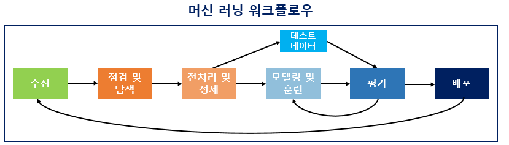

# **01. [기초] - 딥 러닝을 시작하기 전에**

## 01-01 코랩과 아나콘다

윈도우 환경을 기준으로 두고 아나콘다를 설치하는 방법과 인터넷을 통해 편하게 사용할 수 있는 파이썬 실습 환경인 구글의 코랩(Colab)이 있다.

→ **코랩 이용!**

- Colab 주소 : https://colab.research.google.com/
- 코랩은 주피터 노트북과 매우 유사한 실습 환경 제공
- 딥러닝에서는 CPU보다 GPU 이용하므로 런타임 유형 변경 권장

## 01-02 필요한 기본 패키지 설치

코랩에서 실습 진행하므로 패스~~

## 01-03 머신 러닝 워크플로우

**머신 러닝 워크플로우(Machine Learning Workflow)**



1. **수집(Acquisition)**
    - 기계에 학습시켜야 할 데이터가 필요하다. 자연어 처리의 경우, 자연어 데이터를 corpus(코퍼스)라고 부른다. 이는 조사나 연구 목적에 의해서 특정 도메인으로부터 수집된 텍스트 집합이다. 텍스트 데이터의 파일 형식은 txt 파일, csv 파일, xml 파일 등이 있고 음성 데이터, 웹 수집기 등을 통해 얻게 된다.
2. **점검 및 탐색(Inspection and exploration)**
    - 데이터의 구조, 노이즈 데이터, 머신 러닝 적용을 위해서 데이터를 어떻게 정제해야하는지 등을 파악해야 한다.
    - 탐색적 데이터 분석(Exploratory Data Analysis, EDA) 단계라고도 하는데 이는 독립 변수, 종속 변수, 변수 유형, 변수의 데이터 타입 등을 점검하며 데이터의 특징과 내재하는 구조적 관계를 알아내는 과정을 의미한다. 이 과정에서 시각화와 간단한 통계 테스트를 진행하기도 한다.
3. **전처리 및 정제(Preprocessing and Cleaning)**
4. **모델링 및 훈련(Modeling and Training)**
    - 적절한 머신 러닝 알고리즘을 선택하여 모델링이 끝났다면, 전처리가 완료 된 데이터를 머신 러닝 알고리즘을 통해 기계에게 학습(training)시킨다. 이를 훈련이라고도 한다. 기계가 데이터에 대한 학습을 마치고나서 훈련이 제대로 되었다면 그 후에 기계는 우리가 원하는 태스크(task)인 기계 번역, 음성 인식, 텍스트 분류 등의 자연어 처리 작업을 수행할 수 있게 된다.
    
    💥 **주의점!**
    
    - 대부분의 경우에서 모든 데이터를 기계에게 학습시켜서는 안 된다. 데이터 중 일부는 테스트용으로 남겨두고 훈련용 데이터만 훈련에 사용해야 한다. 그래야만 기계가 학습을 하고나서, 테스트용 데이터를 통해서 현재 성능이 얼마나 되는 지를 측정할 수 있으며 과적합(overfitting) 상황을 막을 수 있다.
    
        
    
    - 검증용 데이터: 현재 모델의 성능. 즉, 기계가 훈련용 데이터로 얼마나 제대로 학습이 되었는지를 판단하는 용으로 사용되며 검증용 데이터를 사용하여 모델의 성능을 개선하는데 사용된다.
    - 테스트용 데이터: 모델의 최종 성능을 평가하는 데이터로 모델의 성능을 개선하는 일에 사용되는 것이 아니라, 모델의 성능을 수치화하여 평가하기 위해 사용된다.
5. **평가(Evaluation)**
    - 테스트용 데이터로 성능 평가한다. 평가 방법은 기계가 예측한 데이터가 테스트용 데이터의 실제 정답과 얼마나 가까운 지를 측정한다.
6. **배포(Deployment)**
    - 평가 단계에서 기계가 성공적으로 훈련이 된 것으로 판단된다면 완성된 모델이 배포된다.
    

## 01-04 **판다스(Pandas) and 넘파이(Numpy) and 맷플롭립(Matplotlib)**

1. **판다스(Pandas)**
    - 파이썬 데이터 처리를 위한 라이브러리
    - pd라는 명칭으로 임포트하는 것이 관례
    - 총 3가지의 데이터 구조 사용 - 시리즈, 데이터프레임, 패널
        - **시리즈(Series)** - 인덱스(index), 값(values)
            - 1차원 배열의 값(values)에 각 값에 대응되는 인덱스(index)를 부여할 수 있는 구조
        - **데이터프레임(DataFrame)** - 열(columns), 인덱스(index), 값(values)
            - 2차원 리스트를 매개변수로 전달
            - 행방향 인덱스(index)와 열방향 인덱스(column) 존재(행과 열을 가지는 자료 구조)
            - 생성
                - 리스트(List), 시리즈(Series), 딕셔너리(dict), Numpy의 ndarrays, 또 다른 데이터프레임으로부터 생성 가능
            - 조회
                - df.head(n) - 앞 부분을 n개만 보기
                - df.tail(n) - 뒷 부분을 n개만 보기
                - df['열이름'] - 해당되는 열을 확인
            - 외부 데이터 읽기
                - CSV, 텍스트, Excel, SQL, HTML, JSON 등 다양한 데이터 파일을 읽고 데이터 프레임을 생성할 수 있다.
                - ex) csv 파일 읽을 때 pandas.read_csv() 사용
        - **패널(Panel)**
2. **넘파이(Numpy)**
    - 수치 데이터를 다루는 파이썬 패키지
    - 다차원 행렬 자료구조인 **ndarray**를 통해 벡터 및 행렬을 사용하는 선형대수 계산에서 주로 사용
    - np.array()
        - 리스트, 튜플, 배열로부터 ndarray를 생성
        - Numpy 배열에는 축의 개수(ndim)와 크기(shape)라는 개념이 존재하는데, 배열의 크기를 정확히 숙지하는 것은 딥러닝에서 매우 중요!!
    - ndarray 초기화
        - np.zeros() - 배열의 모든 원소에 0을 삽입
        - np.ones() - 배열의 모든 원소에 1을 삽입
        - np.full() -  배열에 사용자가 지정한 값을 삽입
        - np.eye() - 대각선으로는 1이고 나머지는 0인 2차원 배열을 생성
        - np.random.random() - 임의의 값을 가지는 배열을 생성
    - np.arange()
        - np.arange(n) - 0부터 n-1까지의 값을 가지는 배열을 생성
        - np.arange(i, j, k) - i부터 j-1까지 k씩 증가하는 배열을 생성
    - np.reshape()
        - 내부 데이터는 변경하지 않으면서 배열의 구조를 바꾼다.
    - Numpy 슬라이싱
        - ndarray를 통해 만든 다차원 배열은 파이썬의 자료구조인 리스트처럼 슬라이싱(slicing) 기능을 지원
    - Numpy 정수 인덱싱(integer indexing)
        - 슬라이싱을 사용하면 배열로부터 부분 배열을 추출할 수 있지만, 연속적이지 않은 원소로 배열을 만들 경우에는 슬라이싱으로는 만들 수 없다.
        - 이런 경우에는 인덱싱을 사용하여 배열을 구성할 수 있다. 인덱싱은 원하는 위치의 원소들을 뽑을 수 있다.
    - Numpy 연산
        - 덧셈, 뺄셈, 곱셈, 나눗셈을 위해서는 연산자 +, -, *, /를 사용할 수 있으며 또는 np.add(), np.subtract(), np.multiply(), np.divide()를 사용할 수도 있다.
        
        ```python
        # result = np.add(x, y)와 동일.
        result = x + y
        
        # result = np.subtract(x, y)와 동일.
        result = x - y
        
        # result = np.multiply(result, x)와 동일, 요소별 곱
        result = result * x
        
        # result = np.divide(result, x)와 동일.
        result = result / x
        
        # 벡터와 행렬곱 또는 행렬곱을 위해서는 dot() 사용.
        mat1 = np.array([[1,2],[3,4]])
        mat2 = np.array([[5,6],[7,8]])
        mat3 = np.dot(mat1, mat2)
        ```
        
3. **맷플롭립(Matplotlib)**
    - 데이터를 차트(chart)나 플롯(plot)으로 시각화하는 패키지
    - Matplotlib의 주요 모듈인 pyplot를 관례상 plt라는 명칭으로 임포트
    - 라인 플롯
        - plot() - x축과 y축 값 기재
    - 축 레이블 삽입
        - x축과 y축 각각에 축이름을 삽입하고 싶다면 xlabel('넣고 싶은 축이름')과 ylabel('넣고 싶은 축이름')을 사용
    - 라인 추가와 범례 삽입
        - 여러개의 라인 플롯을 동시에 사용할 경우에는 각 선이 어떤 데이터를 나타내는지를 보여주기 위해 범례(legend)를 사용

## 01-05 **데이터의 분리(Splitting Data)**

→ 지도 학습을 위한 데이터 분리 작업

- 지도 학습(Supervised Learning)
    - 훈련 데이터는 정답이 무엇인지 맞춰 하는 '문제'에 해당되는 데이터와 레이블이라고 부르는 '정답'이 적혀있는 데이터로 구성
    - **<훈련 데이터>**
        
        X_train : 문제지 데이터
        
        y_train : 문제지에 대한 정답 데이터
        
    - **<테스트 데이터>**
        
        X_test : 시험지 데이터.
        
        y_test : 시험지에 대한 정답 데이터
        
    - 기계는  X_train과 y_train에 대해서 학습한다. 그 후, 학습을 다 한 기계에게 y_test는 보여주지 않고, X_test에 대해서 정답을 예측하게 한다. 그리고 기계가 예측한 답과 실제 정답인 y_test를 비교하면서 기계가 정답을 얼마나 맞췄는지를 평가한다. → 이 수치가 기계의 **정확도(Accuracy)**
- X와 y 분리
    - zip 함수를 이용하여 분리
        - zip()함수는 동일한 개수를 가지는 시퀀스 자료형에서 각 순서에 등장하는 원소들끼리 묶는다. 리스트의 리스트 구성에서 분리하는데 유용
    - 데이터프레임을 이용하여 분리하기
        - 데이터프레임은 열의 이름으로 각 열에 접근이 가능
    - Numpy를 이용하여 분리하기
        - Numpy의 슬라이싱(slicing)을 사용하여 데이터를 분리
- 테스트 데이터 분리
    - 사이킷 런을 이용하여 분리하기
        - 사이킷런은 학습용 테스트와 테스트용 데이터를 쉽게 분리할 수 있게 해주는 train_test_split()를 지원
            
            ```python
            X_train, X_test, y_train, y_test = train_test_split(X, y, test_size= 0.2, random_state=1234)
            
            #X : 독립 변수 데이터. (배열이나 데이터프레임)
            #y : 종속 변수 데이터. 레이블 데이터.
            #test_size : 테스트용 데이터 개수를 지정한다. 1보다 작은 실수를 기재할 경우, 비율을 나타낸다.
            #train_size : 학습용 데이터의 개수를 지정한다. 1보다 작은 실수를 기재할 경우, 비율을 나타낸다.
            #random_state : 난수 시드
            ```
            
        - train_test_split()은 기본적으로 데이터의 순서를 섞고나서 훈련 데이터와 테스트 데이터를 분리
        - random_state의 값을 고정해두면 실행할 때마다 항상 동일한 순서로 데이터를 섞으므로, 동일한 코드를 다음에 재현하고자 할 때 사용할 수 있다.
    - 수동으로 분리하기