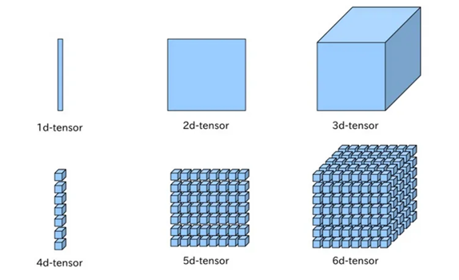
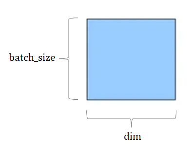
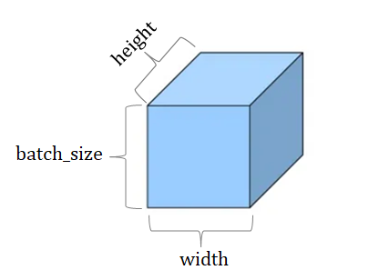
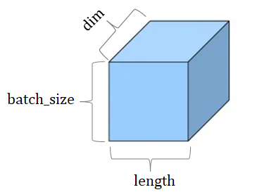

# **02. [기초] - 파이토치 기초**

## 02-01 파이토치 패키지의 기본 구성

1. torch
   - 메인 네임스페이스
2. torch.autograd
   - 자동 미분을 위한 함수들 포함
     - ex) enable_grad/no_grad: 자동 미분의 on/off 제어하는 콘텍스트 매니저
     - ex\_ ‘Function’: 자체 미분 가능 함수를 정의할 때 사용하는 기반 클래스
3. torch.nn
   - 신경망을 구축하기 위한 레이어, 활성화 함수, 손실 함수 등 포함
     - ex) RNN, LSTM/ReLU/MSELoss
4. torch.optim
   - 확률적 경사 하강법(Stochastic Gradient Descent, SGD)을 중심으로 한 파라미터 최적화 알고리즘 포함
5. torch.utils.data
   - SGD의 반복 연산을 실행할 때 사용하는 미니 배치용 유틸리티 함수 포함
6. torch.onnx
   - ONNX(Open Neural Network Exchange)의 포맷으로 모델을 export할 때 사용
     - ONNX: 서로 다른 딥 러닝 프레임워크 간에 모델을 공유할 때 사용

## 02-02 텐서 조작하기

1. 벡터, 행렬 그리고 텐서(Vector, Matrix and Tensor)

   1. 벡터, 행렬 그리고 텐서(Vector, Matrix and Tensor)

      

      - 가장 기본적인 단위
        - 벡터: 1차원으로 구성된 값(1d-tensor)
        - 행렬: 2차원으로 구성된 값(2d-tensor)
        - 텐서: 3차원
          - 4차원 이상부터는 텐서를 위로 쌓아 확장
          - 3차원 이상의 텐서는 다차원 행렬 또는 배열로 간주할 수 있다.
        - cf. 스칼라: 차원이 없는 값

   2. PyTorch Tensor Shape Convention

      

      - 2D Tensor(Typical Simple Setting)
        - 2차원 텐서의 크기 |t| = (batch size, dim) = (batch size × dimension)

      

      - 3D Tensor(Typical Computer Vision): 비전 분야(이미지, 영상 처리)
        - |t| = (batch size, width, height)
        - 비전 분야(이미지, 영상 처리)

      

      - 3D Tensor(Typical Natural Language Processing): NLP 분야
        - |t| = (batch size, length, dim)

2. 넘파이로 텐서 만들기(벡터와 행렬 만들기)

   1. numpy import

      ```python
      import numpy as np
      ```

   2. 텐서 만드는 방법

      ```python
      np.array([숫자, 숫자, 숫자])
      ```

   3. 텐서의 크기(shape)를 표현할 때는 ,(컴마)를 쓰기도 하고 ×(곱하기)를 쓰기도 한다.

3. 파이토치 텐서 선언하기(PyTorch Tensor Allocation)

   1. torch import

      ```python
      import torch
      ```

   2. 브로드캐스팅(Broadcasting)
      - 자동으로 크기를 맞춰서 연산을 수행하게 만든다.
      - 💥 자동으로 실행되는 기능이므로 주의해서 사용!!

4. 자주 사용하는 기능

   1. 행렬 곱셈과 곱셈의 차이(Matrix Multiplication Vs. Multiplication)
   2. 평균(Mean)
   3. 덧셈(Sum)
   4. 최대(Max)와 아그맥스(ArgMax)
   5. 뷰(View) - 원소의 수를 유지하면서 텐서의 크기 변경!
      - view는 기본적으로 변경 전과 변경 후의 텐서 안의 원소의 개수가 유지되어야 한다.
      - 파이토치의 view는 사이즈가 -1로 설정되면 다른 차원으로부터 해당 값을 유추한다.
   6. 스퀴즈(Squeeze) - 1인 차원 제거
   7. 언스퀴즈(Unsqueeze) - 특정 위치에 1인 차원 추가

      view(), squeeze(), unsqueeze()는 텐서의 원소 수를 그대로 유지하면서 모양과 차원을 조절한다.

   8. 타입 캐스팅(Type Casting)
      - 텐서 자료형 변환
   9. 연결하기(concatenate)
      - torch.cat([])
   10. 스택킹(Stacking)
       - 쌓는다는 의미, 많은 연산을 포함하고 있어 때때로 연결보단 스택킹이 편리한 경우가 있다.
       - torch.stack([])
   11. ones_like와 zeros_like - 0으로 채워진 텐서와 1로 채워진 텐서
   12. In-place Operation (덮어쓰기 연산)
       - 연산 뒤에 \_를 붙이면 기존의 값을 덮어쓰기한다.

## 02-03 파이썬 클래스

```python
class Calculator:
    def __init__(self): # 객체 생성 시 호출될 때 실행되는 초기화 함수. 이를 생성자라고 한다.
        self.result = 0

    def add(self, num): # 객체 생성 후 사용할 수 있는 함수.
        self.result += num
        return self.result

```

```python
cal1 = Calculator() # 객체 생성
```

클래스를 선언하고 이 클래스를 통해 별도의 객체를 생성하는 것이 함수 여러 개를 만드는 것보다 간결하다.
