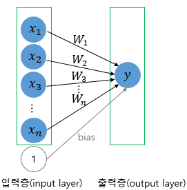
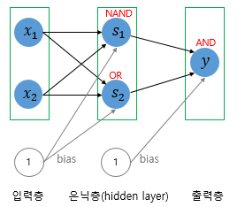
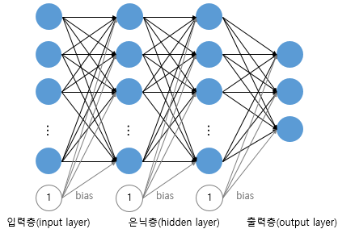
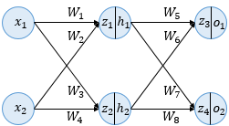
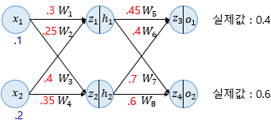

# 06. 인공 신경망

## 06-01 머신 러닝 기본 개념 정리하기

1. 머신 러닝 모델의 평가
    
    `검증형 데이터`
    
    - 모델의 성능을 조정하기 위한 용도
    - 과적합이 되고 있는지 판단하거나 하이퍼파라미터의 조정을 위한 용도
    
    `하이퍼파라미터(초매개변수)`
    
    - 값에 따라서 모델의 성능에 영향을 주는 매개변수들
    - 사용자가 직접 정해줄 수 있는 변수
    
    `매개 변수`
    
    - 사용자가 결정하는 것이 아니라 모델이 학습하는 과정에서 얻어지는 값
    
2. 분류와 회귀
    
    `이진 분류 문제`
    
    - 주어진 입력에 대해 둘 중 하나의 답을 정하는 문제
    
    `다중 클래스 분류`
    
    - 주어진 입력에 대해 세 개 이상의 정해진 선택지 중에서 답을 정하는 문제
    
    `회귀 문제`
    
    - 연속된 값을 결과로 가진다.
    
3. 지도 학습과 비지도 학습
    
    **머신러닝은 크게 지도 학습, 비지도 학습 그리고 강화 학습으로 나뉜다.** 
    
    `지도 학습`
    
    레이블(정답)과 함께 학습
    
    기계는 예측값과 실제값의 차이인 오차를 줄이는 방식으로 학습
    
    `비지도 학습`
    
    - 목적 데이터(레이블)가 없는 학습
    - ex) 군집(clustering), 차원 축소
    
    `강화 학습`
    
    - 어떤 환경 내에서 정의된 에이전트가 현재의 상태를 인식하여 선택 가능한 행동들 중 보상을 최대화하는 행동을 선택
    
4. 샘플과 특성
    
    **머신 러닝 문제는 대부분 1개 이상의 독립 변수 *x*를 가지고 종속 변수 *y*를 예측한다.** 
    
    독립 변수 *x*의 행렬을 X라고 했을 때, 독립 변수의 개수가 n개이고 데이터의 개수가 m인 행렬 X가 있다고 하자. 
    
    `샘플`
    
    하나의 데이터, 하나의 행
    
    `특성`
    
    종속 변수 *y*를 예측하기 위한 각각의 독립 변수 *x*
    
5. 혼동 행렬
    
    `정확도`
    
    - 맞춘 문제 수를 전체 문제 수로 나눈 값
    
    `혼동 행렬`
    
    - 맞춘 결과와 틀린 결과에 대한 세부적인 내용을 알려준다.
    - 각 행은 실제 값, 각 열은 예측 값
        
        
        |  | 참 | 거짓 |
        | --- | --- | --- |
        | 참 | TP | FN |
        | 거짓 | FP | TN |
        
        TP(True Positive), TN(True Negative), FP(False Positive), FN(False Negative)
        
        True: 정답을 맞춘 경우 / False: 정답을 맞추지 못한 경우
        
        Positive, Negative: 각각 제시했던 정답
        
    
    `정밀도`
    
    - 양성이라고 대답한 전체 케이스에 대한 TP의 비율
    
    $$
    Precision = \frac{TP}{TP + FP}
    $$
    
    `재현률`
    
    - 실제 값이 양성인 데이터의 전체 개수에 대해서 TP의 비율(양성인 데이터 중에서 얼마나 양성인지를 예측(재현)했는지)
    
    $$
    Recall = \frac{TP}{TP+FN}
    $$
    
6. 과적합과 과소 적합
    
    `과적합`
    
    - 훈련 데이터를 과하게 학습한 경우
    - 훈련 데이터에 대해서는 오차가 낮지만, 테스트 데이터에 대해서는 오차가 높아진다.
    
    `과소적합`
    
    - 테스트 데이터의 성능이 올라갈 여지가 있음에도 훈련을 덜 한 상태
    - 훈련 데이터에 대해서도 정확도가 낮다.
    
7. 비선형 활성화 함수
    
    `비선형 활성화 함수`
    
    - 입력을 받아 수학적 변환을 수행하고 출력을 생성하는 함수
    - ex) 시그모이드 함수, 소프트맥스 함수
    
    `활성화 함수는 선형 함수가 아닌 비선형 함수여야 한다.`
    
    - 선형 함수로는 은닉층을 여러 번 추가하더라도 1회 추가한 것과 차이가 없다.
    
    `은닉층의 활성화 함수로 ReLu 또는 Leaky ReLU와 같은 ReLU의 변형 사용`
    
    | **문제** | **활성화 함수** | **비용 함수** |
    | --- | --- | --- |
    | 이진 분류 | 시그모이드 | nn.BCELoss() |
    | 다중 분류 | 소프트맥스 | nn.CrossEntropyLoss() |
    | 회귀 | 없음 | MSE |

## 06-0**2 퍼셉트론**

1. `퍼셉트론(Perceptron)`
    - 초기의 인공 신경망
    - 다수의 입력으로부터 하나의 결과를 내보내는 알고리즘
    - 활성화 함수로 계단 함수 사용
    - 활성화 함수를 시그모이드 함수로 변경하면 로지스틱 회귀와 동일
    - 단층 퍼셉트론과 다층 퍼셉트론으로 나누어진다.
    
    $$
    f(\sum_i^{n} W_{i}x_{i} + b)
    $$
    
2. `단층 퍼셉트론`
    
    
    
    - 값을 보내는 단계와 값을 받아서 출력하는 두 단계(**입력층**, **출력층**)로 이루어진다.
    - AND, NAND, OR 게이트 쉽게 구현 가능
    - XOR 게이트 구현 불가능(단층 퍼셉트론은 직선 하나로 두 영역을 나눌 수 있는 문제에 대해서만 구현 가능)
    
3. `다층 퍼셉트론`
    
    
    
    - 단층 퍼셉트론에서 중간에 층을 더 추가(**은닉층**)
    - XOR 문제보다 더 복잡한 문제를 해결하기 위해 중간에 수많은 은닉층 추가 가능
    
    
    
    - **심층 신경망**(DNN): 은닉층이 2개 이상인 신경망

## 06-03 XOR 문제 구현하기 - 단층 퍼셉트론과 다층 퍼셉트론

코드 실습!

## **06-04 역전파(BackPropagation)**

`예제) 인공 신경망`

- 입력층, 은닉층, 출력층(3개의 층)
- 두 개의 입력, 두 개의 은닉층 뉴런, 두 개의 출력층 뉴런 사용
- 은닉층과 출력층의 모든 뉴런은 활성화 함수로 시그모이드 함수 사용
- 편향 *b* 고려x

`순전파(Forward Propagation)`

- 시그모이드 함수의 입력
    
    $$
    z_{1}=W_{1}x_{1} + W_{2}x_{2}=0.3 \text{×}  0.1 + 0.25 \text{×} 0.2 = 0.08
    $$
    
    $$
    z_{2}=W_{3}x_{1} + W_{4}x_{2}=0.4 \text{×}  0.1 + 0.35 \text{×} 0.2 = 0.11
    $$
    

`역전파(Backpropagation)`

- 출력층에서 입력층 방향으로 계산하면서 가중치를 업데이트

<aside>
🐬

인공신경망 학습은 오차를 최소화하는 가중치를 찾는 목적으로 순전파와 역전파 반복!

</aside>

## **06-05 다층 퍼셉트론으로 손글씨 분류하기**

코드 실습!

## **06-06 다층 퍼셉트론으로 MNIST 분류하기**

코드 실습!

## **06-07 과적합(Overfitting)을 막는 방법들**

`과적합 문제점`

- 모델 성능 감소
- 훈련 데이터에 대한 정확도는 높지만, 새로운 데이터에 대해서는 제대로 동작x
    - 과한 학습으로 인해 훈련 데이터에 포함된 노이즈까지 학습한 상태이기 때문

`과적합 막는 방법`

1. 데이터 양 늘리기
    - 모델은 데이터의 일반적인 패턴을 학습하여 과적합 방지 가능
    - 데이터 증식 또는 증강(Data Augmentation)
2. 모델의 복잡도 줄이기
    - 모델의 복잡도는 은닉층의 수나 매개변수의 수 등으로 결정된다.
        - 모델에 있는 매개변수의 수: 모델의 수용력(capacity)
3. 가중치 규제(Regularization) 적용하기
    - 복잡한 모델을 좀 더 간단하게 하기
    - **L1 규제**
        - 가중치 w들의 절대값 합계를 비용 함수에 추가
    - **L2 규제**
        - 모든 가중치 w들의 제곱합을 비용 함수에 추가
4. 드롭아웃(Dropout)
    - 학습 과정에서 신경망 일부를 사용하지 않는 방법
    - 신경망 학습 시에만 사용하고, 예측 시에는 사용하지 않는 것이 일반적

## **06-08 기울기 소실(Gradient Vanishing)과 폭주(Exploding)**

`기울기 소실`

- 입력층에 가까운 층들에서 가중치들이 업데이트가 제대로 되지 않으면, 결국 최적의 모델을 찾지 못한다.

`기울기 폭주`

- 기울기가 점차 커지면서 가중치들이 비정상적으로 큰 값이 되어 발산되는 것

`기울기 소실, 기울기 폭주를 막는 방법`

1. ReLU와 ReLU의 변형들
    - 은닉층의 활성화 함수로 시그모이드나 하이퍼볼릭탄젠트 함수 대신 ReLU나 ReLU의 변형 함수와 같은 Leaky ReLU를 사용
    - Leaky ReLU를 사용하면 모든 입력값에 대해서 기울기가 0에 수렴하지 않아 죽은 ReLU 문제를 해결 능
2. 가중치 초기화
    - 같은 모델을 훈련시키더라도 가중치 초기값에 따라 모델의 훈련 결과 달라진다.
    - **세이비어 초기화**
        - 균등 분포 또는 정규 분포로 초기화 할 때로 나누어진다.
        - 여러 층의 기울기 분산 사이에 균형을 맞춰서 특정 층이 너무 주목을 받거나 다른 층이 뒤쳐지는 것을 막는다.
        - S자 형태인 활성화 함수와 함께 사용할 경우에는 성능이 좋은 반면 ReLU와 함께 사용할 경우에는 성능이 좋지 x
    - **He 초기화**
        - 세이비어 초기화와 유사하게 정규 분포와 균등 분포로 나누어진다.
        - 다음 층의 뉴런의 수를 반영x
        - ReLU 계열 함수를 사용할 경우에 효율적
3. 배치 정규화
    - 인공 신경망의 각 층에 들어가는 입력을 평균과 분산으로 정규화하여 학습을 효율적으로 만든다.
    - **내부 공변량 변화**
        - 학습 과정에서 층별로 입력 데이터 분포가 달라지는 현상
    - **배치 정규화**
        - 한 번에 들어오는 배치 단위로 정규화하는 것
        - 각 층에서 활성화 함수를 통과하기 전에 수행
    - 배치 정규화 한계점
        - 미니 배치 크기에 의존적
        - RNN에 적용하기 어려움
4. 층 정규화