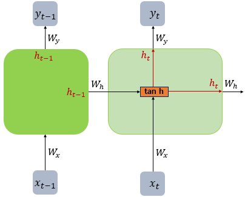
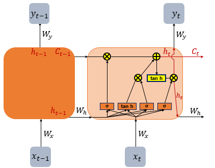

# 07. 순환 신경망

## 07-01 **순환 신경망(Recurrent Neural Network, RNN)**

1. 순환 신경망
    - 은닉층의 노드에서 활성화 함수를 통해 나온 결과값을 출력층 방향으로도 보내면서, 다시 은닉층 노드의 다음 계산의 입력으로 보낸다.
    - `셀(메모리 셀, RNN 셀)`
        
        은닉층에서 활성화 함수를 통해 결과를 내보내는 역할을 하는 노드
        
    - `은닉상태`
        
        메모리 셀이 출력층 방향으로 또는 다음 시점 t+1의 자신에게 보내는 값
        
         t 시점의 메모리 셀은 t-1 시점의 메모리 셀이 보낸 은닉 상태값을 t 시점의 은닉 상태 계산을 위한 입력값으로 사용
        
2. 양방향 순환 신경망
    - t에서의 출력값을 예측할 때 이전 시점의 데이터뿐만 아니라, 이후 데이터로도 예측 가능
    - 2개의 메모리 셀 사용
        
        `첫 번째 메모리 셀`: 앞 시점의 은닉 상태를 전달 받아 현재의 은닉 상태를 계산
        
        `두 번째 메모리 셀`: 뒤 시점의 은닉 상태를 전달 받아 현재의 은닉 상태를 계산
        
        두 개의 값 모두 출력층에서 출력값을 예측하기 위해 사용
        

## 07-02 LSTM과 GRU

**LSTM: 바닐라 RNN의 한계를 극복하기 위한 RNN 변형 중 하나**

1. 바닐라 RNN의 한계
    - `장기 의존성 문제`
        
        출력 결과가 이전의 계산 결과에 의존
        
        비교적 짧은 시퀀스에 대해서만 효과 있다.
        
        시점이 길어질 수록 앞의 정보가 뒤로 충분히 전달되지 못하는 현상 발생
        
2. 바닐라 RNN 내부 열어보기
    
    
    
    $$
    h_{t} = tanh(W_{x}x_{t} + W_{h}h_{t−1} + b)
    $$
    
3. LSTM
    
    
    
    - RNN의 단점 보완
    - 은닉층의 메모리 셀에 입력 게이트, 망각 게이트, 출력 게이트를 추가하여 불필요한 기억 삭제
4. GRU
    
    
    
    - 업데이트 게이트, 리셋 게이트 추가
    - 경험적으로 데이터 양이 적을 때는 GRU, 데이터 양이 많을 때는 LSTM이 더 낫다.