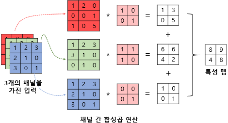

# 08-01 합성곱과 풀링

**`합성곱 신경망`**

이미지 처리에 탁월한 성능

합성곱 층과 풀링 층으로 구성

1. 합성곱 신경망의 대두
    
    이미지의 공간적인 구조 정보를 보존하면서 학습할 수 있는 방법 필요
    
2. 채널
    
    `이미지` 
    
    - **(높이, 너비, 채널)**이라는 3차원 텐서
    - 높이: 이미지의 세로 방향 픽셀 수
    - 너비: 이미지의 가로 방향 픽셀 수
    - 채널: 색 성분
    - 흑백 이미지: 채널 수 1
    - 컬러 이미지: 적색(Red), 녹색(Green), 청색(Blue) 채널 수 3
    - 각 픽셀은 0~255 값
3. 합성곱 연산
    
    `합성곱 층`
    
    - 합성곱 연산을 통해서 이미지의 특징 추출
    
    `합성곱 연산`
    
    - **커널** 또는 **필터**라는 n x m 크기의 행렬로 높이 x 너비 크기의 이미지를 훑으면서 n x m 크기의 겹쳐지는 부분의 각 이미지와 커널의 원소의 값을 곱해서 모두 더한 값을 출력
    - 커널은 일반적으로 3x3 또는 5x5 사용
    - 특성 맵: 입력으로부터 커널을 사용하여 합성곱 연산을 통해 나온 결과
    - 스트라이드: 커널의 이동 범위
4. 패딩
    - 합성곱 연산 이후에도 특성 맵의 크기가 입력의 크기와 동일하게 유지되도록 한다.
    - 합성곱 연산을 하기 전에 입력의 가장자리에 지정된 개수의 폭만큼 행과 열을 추가
    - 주로 제로 패딩 사용
5. 특성 맵의 크기 계산 방법
    
    $$
    O_{h} = floor(\frac{I_{h} - K_{h} + 2P}{S}+1)
    $$
    
    $$
    O_{w} = floor(\frac{I_{w} - K_{w} + 2P}{S}+1)
    $$
    
6. 다수의 채널을 가질 경우의 합성곱 연산
    
    
    
    - 커널은 3개가 아니라 3개의 채널을 가진 1개
7. 풀링
    
    `풀링층`
    
    - 특성 맵을 다운샘플링하여 특성 맵의 크기를 줄이는 풀링 연산 사용
    
    `풀링 연산`
    
    - 학습해야 할 가중치가 없으며 연산 후에 채널 수가 변하지 않는다.
    - **최대 풀링**과 **평균 풀링** 사용
    - 최대 풀링: 커널과 겹치는 영역 안에서 최댓값을 추출
    - 평균 풀링: 평균값을 추출